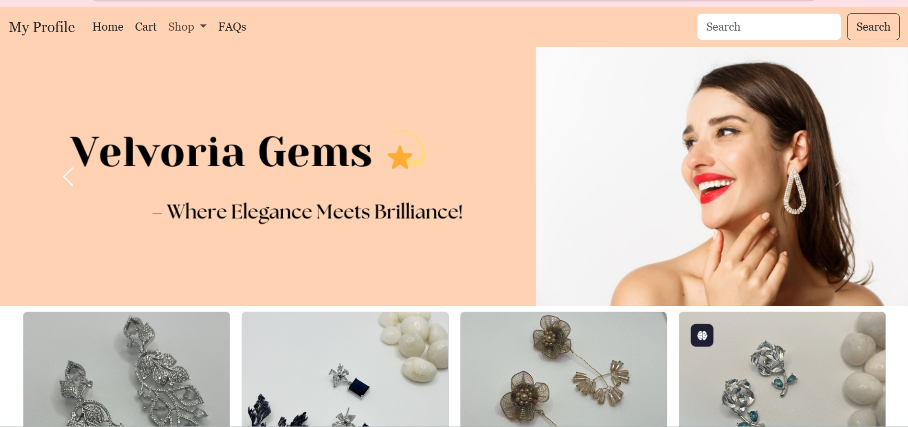
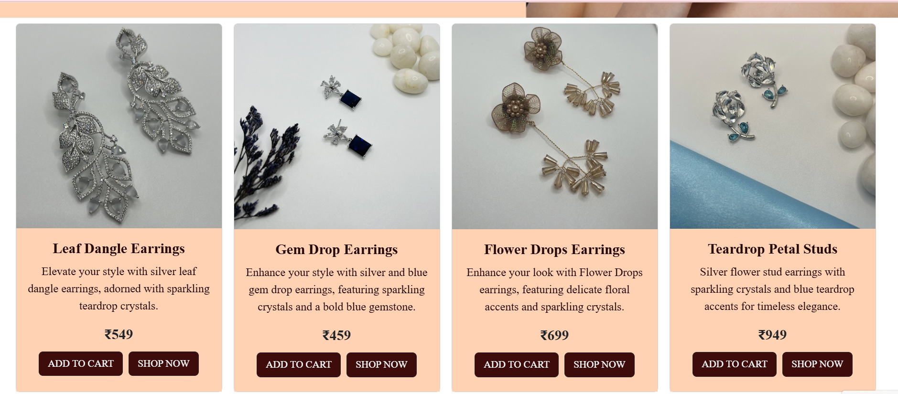
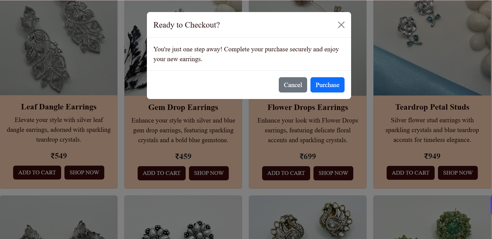

# Earrings E-Commerce Website

## 🛍️ About the Project
This is a responsive e-commerce website for earrings built using **Bootstrap 5**, **HTML**, and **CSS**. The website features an elegant and user-friendly design that allows users to browse and purchase different styles of earrings with ease.

## ✨ Features
- 🎨 **Beautiful UI** – Stylish and minimalistic design with soft pastel colors.
- 🖼️ **Carousel Banner** – Engaging image slider showcasing featured products.
- 🛒 **Add to Cart & Shop Now Modals** – Interactive pop-ups for seamless shopping.
- 📱 **Fully Responsive** – Optimized for all screen sizes using Bootstrap grid system.
- 🔍 **Search Functionality** – Integrated search bar for easy navigation.
- 📂 **Dropdown Categories** – Organized sections for different earring styles.

## 🔧 Technologies Used
- **HTML5** – Structuring the webpage content.
- **CSS3** – Custom styling for an aesthetic look.
- **Bootstrap 5** – Ensuring responsiveness and fast development.

## 📸 Screenshots

## 🚀 How to Run the Project
1. Clone the repository:
   git clone https://github.com/ManvithaPola/Earrings-page.git
2. Open `index.html` in your browser.

## 💡 What I Learned
- Utilizing **Bootstrap components** effectively.
- Implementing **modals** for a better shopping experience.
- Enhancing UI with **color schemes, typography, and layout techniques**.
- Using **media queries** for responsiveness.

## 📌 Future Improvements
- 🛠️ Adding a **fully functional backend** with authentication & payment integration.
- 🎨 Enhancing **product filtering & sorting features**.
- 📧 Implementing a **newsletter subscription feature**.